# Week 5: 

[cheatsheet](https://github.com/adam-p/markdown-here/wiki/Markdown-Cheatsheet)
# Trouble shooting with Google: where the programming starts


Noted this week is 
* **NOT** about advanced techniques and skills for R studio
* **NOT** about following each step and reproducing each result or graphs
* about practice solving problems **on your own**
* **Dont rush** doing this worksheet. 
* Better way to use this worksheet: stop and think how you will do to find the soluation, how you want to approach the issue, and then move on.


Learning objective:

* To use right sources and platform to search and debug
* To locate problem
* To formulate a "good" question


When see errors, do not panic.

Coders/data scientists, fix errors and mistakes, all the time. Today, let s talk about how to troubleshoot yourself.

After a while of coding, you will know how and where to start to fix the problem. Before that, you can try following general strategies to debug an error:


1. **Google**
 * Read the ERROR MESSAGE! Most error message does tell you what the problem is. Google it.
 * Many times it is a common error with a known solution. Sometime, even just copy paste your error message, you will find many people had the exactly issue like yours before.
 * Change a way to describe your problem if you cannot find the solution. 
 * Sometime, results from Google costs a lot of time to filter (particularly, when you ask in a not so good way), try other professional platforms, such as: stackoverflow, w3schools.com, codeproject.com


2. **Go back to your dataset**

Just check your data, even it is readable and loadable.

**DON'T MAKE CHANGES TO THE ORIGINAL DATA** 

In some situation, it is a good idea to suspect the original data, and you can do a backup and then modify the dataset and then run the code again to see if your doubt is correct.
        
       
2. **Repeate it with simpler/smaller data**
 * Create a minimal, reproducible example using simple data
 * Note which inputs don’t trigger the error
 * If not already done, write simple tests to reduce chances of creating a new bug


3. **Figure out where the error is** 
 * Use the “scientific method”, e.g. repeate it a little bit differently (modify your code/arguments just a tiny bit. When modify, try to only change a single variable. In such an way, it is easy to compare and then locate the problem.)
 * Hypothesize, test with experiments, and record results
 * If needed, ask someone else for a second pair of eyes to review


4. **Dont be afraid of testing around**
* Just try it


These steps cam be followed each time you encounter an unexpected error. Many times, you may not even know what line of code the error is coming from. How can you determine where the code is not behaving? You can follow these general steps to answer this question:

 * Begin running the code.
 * Stop the code where you suspect the bug/problem is arising.
 * If necessary, try removing the suspected line to see the changes in the result.
 * Look and/or walk through the code, step-by-step at that point.
 * [**Rubber duck debugging**](https://en.wikipedia.org/wiki/Rubber_duck_debugging). Explain your code to a rubber duck line by line. It will suprise you that many times you can figure out the problem during the process when you talk to your duck. Time to amazon prime yourself a rubber duck.


---
---
## Trouble shooting case study: fix a result


When debugging, do not afraid trying or playing around. Sometime you solve the problem unintentionally when you play around.

### One question a student asked from last week: 

> why the coordinate does not show "2020"?

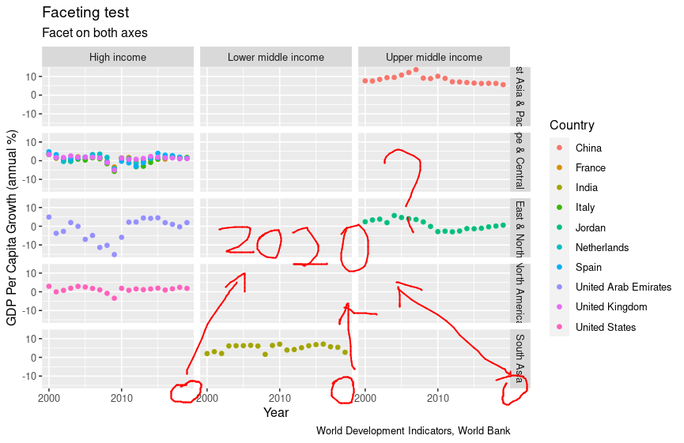


Let s check the code 

```r
ggplot(country_data,aes(year, NY.GDP.PCAP.KD.ZG) ) +
  geom_point(aes(colour =country)) +
  facet_grid(region ~ income) +
  labs(x="Year", y="GDP Per Capita Growth (annual %)",
       title='Faceting test', subtitle = 'Facet on both axes',
       colour="Country",
       caption='World Development Indicators, World Bank') +
       scale_x_continuous(breaks=seq(2000,2020,10))
```

So the problem is about the coordinate. Let s investigate line by line. Obviously, the first few lines should be fine, as they just indicate the data or set up textual titles. E.g., ```aes(year, NY.GDP.PCAP.KD.ZG)```, ``` x= ``` and ``` y= ``` just indicate data, should be fine. Similar for ```title=```, ```colour=``` and ```caption=```.

So we initially focus on 
Within the code, lines regarding coordinate are

```r
scale_x_continuous(breaks=seq(2000,2020,10))
```

We go back to [WEEK 4 material](https://vle.shef.ac.uk/webapps/blackboard/content/listContentEditable.jsp?content_id=_6272367_1&course_id=_103961_1#) to see what it says about ```scale_x_continuous``` (```control+F``` to locate it in the file):
> You can modify which values are shown on the axis of a continuous variable using the **scale_x_continuous** for X axis and scale_y_continuous for Y axis. That function expects a list of numerical values on which to draw axis numbers, and this can easily be created with the seq function. You can use these functions in any plot, not just those with faceting enabled. The example below reduces the number of values shown on the X axis to create a cleaner plot.

After read this, we probably further confirm that ```scale_x_continuous``` is where we should look at. 
Let s further dig into this line/argument by just googling it --> ["scale_x_continuous"]([https://www.google.com/search?q=scale_x_continuous(breaks%3Dseq(2000%2C2020%2C10))&oq=scale_x_continuous(breaks%3Dseq(2000%2C2020%2C10))&aqs=chrome.0.69i59.425j0j7&sourceid=chrome&ie=UTF-8](https://www.google.com/search?q=scale_x_continuous&sxsrf=ALiCzsZ0siBuC0xWiandh7D2MpLGYriRyA%3A1666300368588&ei=0LlRY7W1I_iE9u8Py8uA-A0&ved=0ahUKEwi13bvM3O_6AhV4gv0HHcslAN8Q4dUDCA8&uact=5&oq=scale_x_continuous&gs_lp=Egdnd3Mtd2l6uAED-AEC-AEBMgQQIxgnMgQQABhDMgQQABhDMgQQABhDMgQQABhDMgUQABiABDIFEAAYgAQyBRAAGIAEMgUQABiABDIFEAAYgARI1wVQAFgAcAB4AcgBAJABAJgBXqABXqoBATHiAwQgTRgB4gMEIEEYAOIDBCBGGACIBgE&sclient=gws-wiz))

We go for the first result retrieved (It is possible that you have got something else as your first returned result. It does not matter, what we want is to know more about scale_x_continuous). This leads us to the ggplot2 documentation. PERFECT. 

Conventionally, **a documentation is the most official introduction for a function/package. And it is usually one of the most comprehensive one.**

Now, maybe we can try scaling up the range of the coordinate to see if 2020 will show up.
Let s try ```scale_x_continuous(breaks=seq(2000,2022,10))``` instead of ```scale_x_continuous(breaks=seq(2000,2020,10))```
Then you will find nothing change. Let s try ```scale_x_continuous(breaks=seq(1998,2022,10))``` Now something changes.

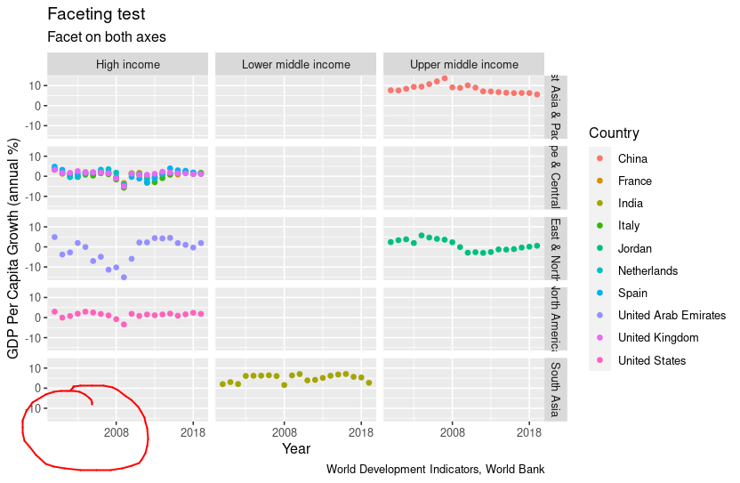

Although "2020" does not show up, the range of years changes on the coordinate. It shows earlier years although it does not show the number. This is a similar issue as what we are looking at: why the coordinate does not show the number? Let s try modifying a different variable, the indicator for the interval (the third digit in the bracket, let s modify it from *10* to *9*) rather than the start and end (the 3rd strategy, **Figure out where the error is**). So let s try  ```scale_x_continuous(breaks=seq(2000,2020,9))```

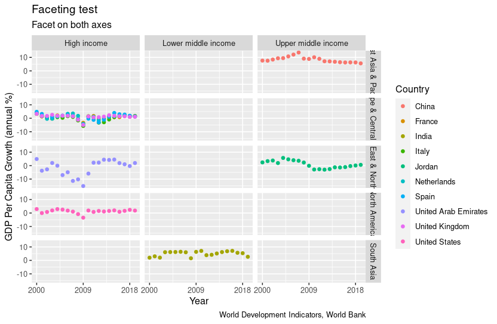

Now, we see 2018 shows up on the coordinate, as the interval changes to 9.


Let's try the second strategy, **Go back to your dataset**. So we check the "year" in the original dataset. We sort the year by *oldest to newest* and then try by *newest to oldest*. 
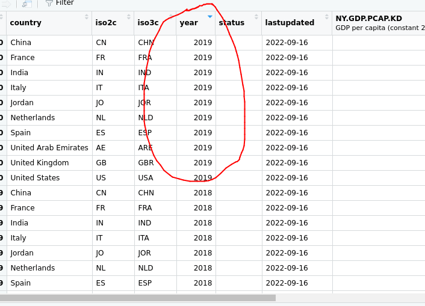

We can find out that there is no data in 2020 in the dataset. This is probably the reason why 2020 does not show up as ggplot2 does not show non-exist data on the coordinate, which does make sense. 

### So what if we want to show the number even there is no data from that year?

What we do in such an troubleshooting situation?

* if you already know the relevent function or package, you could go check the documentation to seek some inspiration
* if not, ofc, it istime !

This time, let s try both ways just to practice. We try the documentation first.

By checking the [documentation](https://ggplot2.tidyverse.org/reference/scale_continuous.html) for the function ```scale_x_continuous``` as we found above, we can see a detailed description for all the available arguments for ```scale_x_continuous```.

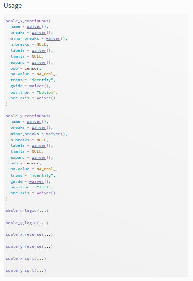

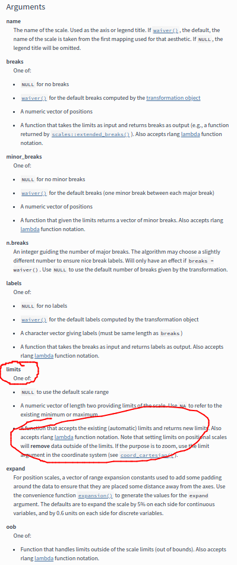

And we find a argument called ```limit```. It maybe the one we are looking for as we want to sort out the *limit* the coordinate shows. According to this documentation on *limit*:
> A function that accepts the existing (automatic) limits and returns new limits. Also accepts rlang lambda function notation. Note that setting limits on positional scales will remove data outside of the limits. If the purpose is to zoom, use the limit argument in the coordinate system (see coord_cartesian()).

As our purpose is kind of *to zoom*, so we go check the link for the limit argument as this part indicates. Then we find a perfect example. 
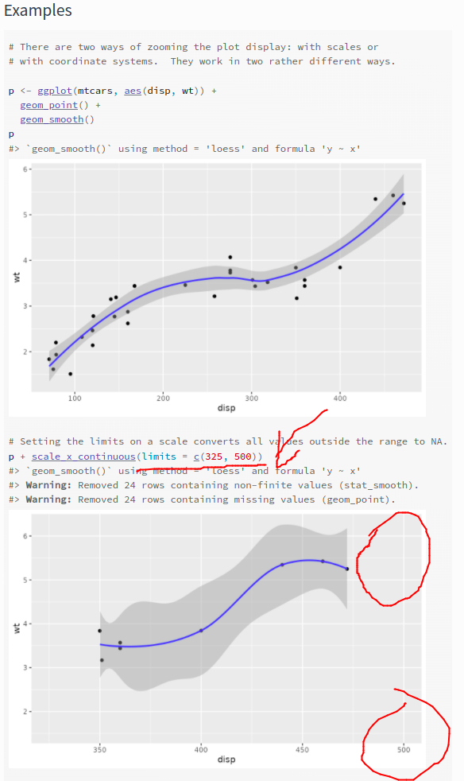

In this example, after adding ```limits = c(325, 500)```, the coordinate *disp* shows the number *500*, even there is not data points within that range. That is exactly what we want: show 2020 even we do not have data points from year 2020.


So we add the ```limits = c(2000, 2020)``` to ```scale_x_continuous```. Now we got 
```r
       scale_x_continuous(breaks=seq(2000,2020,10), limits = c(2000, 2020))
```


And the final code will be
```r
ggplot(country_data,aes(year, NY.GDP.PCAP.KD.ZG) ) +
  geom_point(aes(colour =country)) +
  facet_grid(region ~ income) +
  labs(x="Year", y="GDP Per Capita Growth (annual %)",
       title='Faceting test', subtitle = 'Facet on both axes',
       colour="Country",
       caption='World Development Indicators, World Bank') +
       scale_x_continuous(breaks=seq(2000,2020,10), limits = c(2000, 2020))
```
Now we have the *2020* show up! Problem solved. Give yourself a pat on the back!

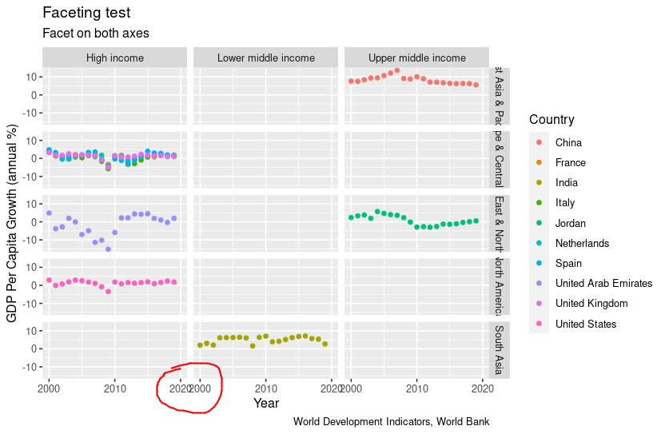
However, there is a overlapping between 2020 and 2000. To solve this, one solution is to increase the spacing between faceted plots. This is, widen the space between. How to do that? Now it is your turn to find it out on you own. Of course, there maybe other solutions to show 2020, feel free to try different methods. 


### Now we try the second way to solve our problem. Using 
What kind of keywords/sentences you would like to use to google for our problem? Please share your answer [here](https://docs.google.com/document/d/1ZnAuv5rBt2bRxbC_dT79xzw6EbDkajYpGLQock-xz7I/edit?usp=sharing).

Let s try  this one I come up with.
> How to change the coordinate limit in r studio

Instead of searching *All* we search for *Images* to speed up our troubleshooting.

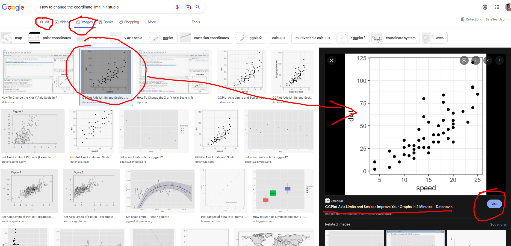

Let s check this image and go to the [website](https://www.datanovia.com/en/blog/ggplot-axis-limits-and-scales/) using this image.

If you check this website, you will find that the page offers different methods to solve our problem, including using ```xlim``` and ```limits = ```. We leave it to you to explore and play around.

---
## Practice: increase the spacing between faceted plots

An advanced requirement is, try only increasing the horizontal spacing, not the vertical spacing, since we just want to remove the overlapping between 2000 and 2020. The vertical space works very well for us. Example for the final result is shown as below. BUT, it is not the only one or the best one.


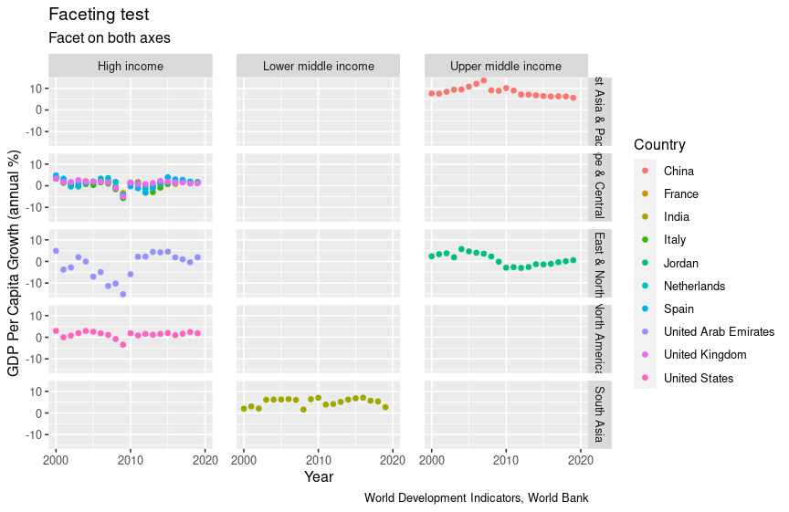
---


---
---
## Trouble shooting case study: create a visualisation from scrach


In this case study, we will try to build a visualisation/plot we do not know how before. It is usually the case that you have the data, you have the topic, you have some fuzzy ideas about what you want to present or communicate to readers, you go browsing online to get some inspiration, you find something that can be used to present your data and your idea. However, you never plot things like this before. So let see how we learn to create it from scratch. 

You are a good student, you want to prepare your INF4000 coursework now even the due is in January. So you go [Kaggle](https://www.kaggle.com/datasets) as suggested in the coursework brief and find this [car](https://www.kaggle.com/datasets/CooperUnion/cardataset) dataset interesting. 

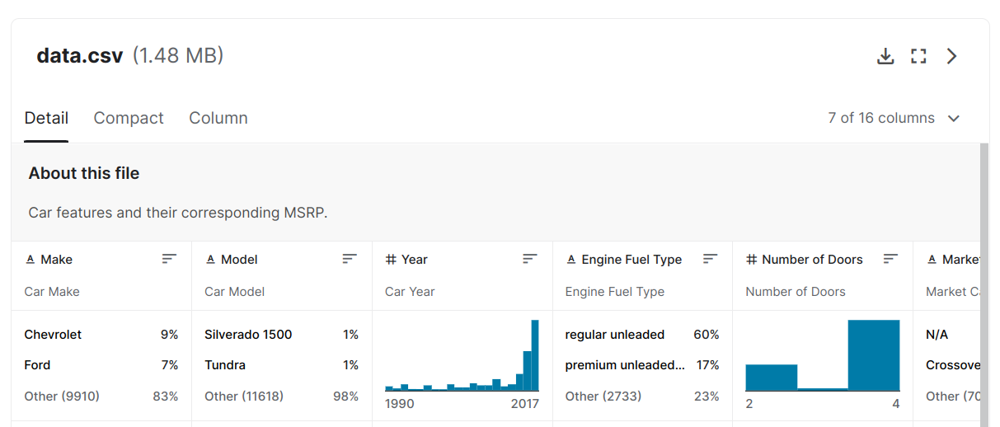

You decide to use this dataset as your data source and your topic is to explore the trend of cars these year. First you want to show the release date distribution for car models, to confirm if there are easy-to-spot some bias or potential pattern. Instead of traditional histogram (as the kaggle default one shown in the screenshot), you want to show the marker a different plot and also you want to embed one more variables in the plot, such as the brand, the vehicle size and the transmission type. And you find someone did this[^1]. 
 

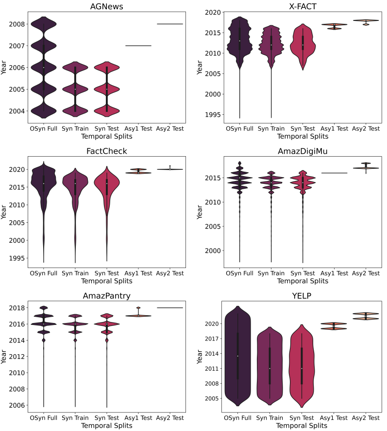

As shown in the plot, the y-axis shows the years, the x-axis shows the year/time distribution of data points in different data split. In our case, we can use the x-axis to show the other variable, such as the brand, the vehicle size and the transmission type.

[^1]: If you are interested in our new [paper](https://arxiv.org/pdf/2210.09197.pdf), welcome to check out.

So we use the image search again as we did above. By searching "Rstudio distribution plot"(Feel free to use the inquiry you like; I believe you definitely come up with something better), we find something like this.
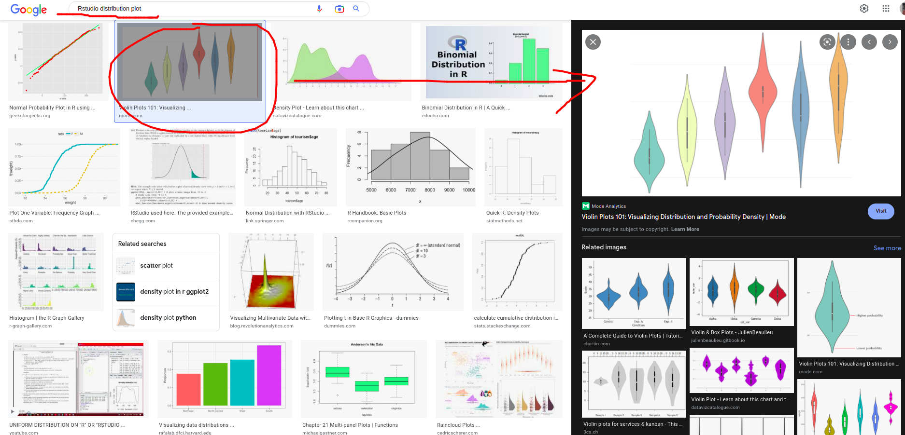

Although the page provides solution in python rather than r, at least we find out this kind of plot is called violin plot. So we optimise our search by adding "violin plot". If you follow me to this point, you possibly have already find a solution. Let s see my search [result](https://r-graph-gallery.com/95-violin-plot-with-ggplot2.html) first. The code is really simple. We convert it to our data. 
```r
car <- read.csv("~/R/wee5/data.csv") # load in our data
library(ggplot2)                     # load ggplot2
p <- ggplot(car, aes(Transmission.Type, Year)) # define data and axis
p + geom_violin()                              # define plot type
```
We got the draft plot. As shown in the plot, AUTOMATED_MANUAL is getting popular. Any other patterns you have identified? Of course, there is room for us to optimize the plot. For example, adding colors, adjust the Year axis to make it more readable. The current version is difficult to tell years between. 

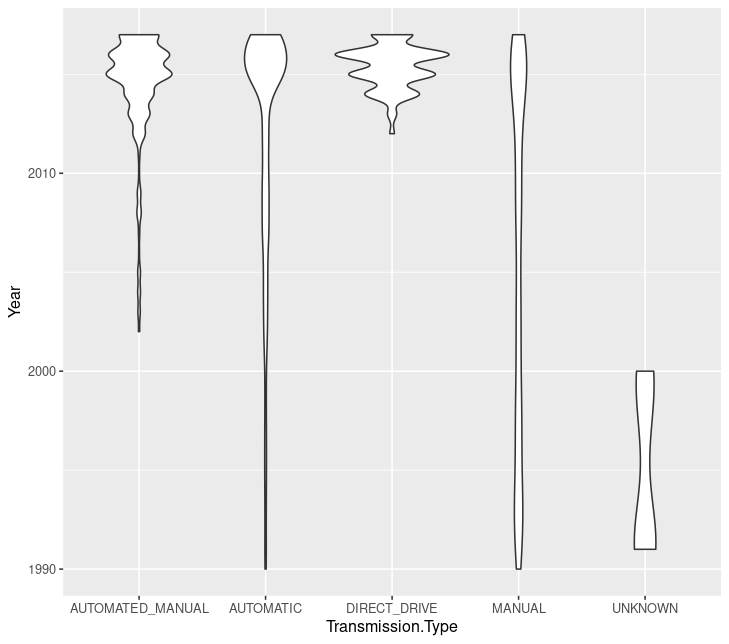

---
---
## Practice: create something by your choose

To practice what we done in today's session and to prepare yourself for the coursework, please think about a topic or a point you want to demonstrate regarding the car dataset or any dataset you would like to use for your coursework, and then go [R graph gallery](https://r-graph-gallery.com/) to find some suitable example for your idea and implement them with your own idea and data. 

The most important thing is, do not be upset about any problem that occurs, that is all this session about, troubleshooting. And do ask questions on worksheets from previous weeks if they have any.


---
---
## Other useful links
* [Hands-On Programming with R](https://rstudio-education.github.io/hopr/debug.html)
* [A case study in debugging R](https://github.com/karawoo/2019-01-17-rstudioconf/blob/master/woo_rstudioconf_2019.pdf)
* [Debugging R Code](https://rstats.wtf/debugging-r-code.html)
* [Advanced R debugging](https://adv-r.hadley.nz/debugging.html)
* [Debugging with the RStudio IDE](https://support.rstudio.com/hc/en-us/articles/205612627-Debugging-with-the-RStudio-IDE)
* [Advanced debugging functions](https://github.com/ColinFay/debugin)
